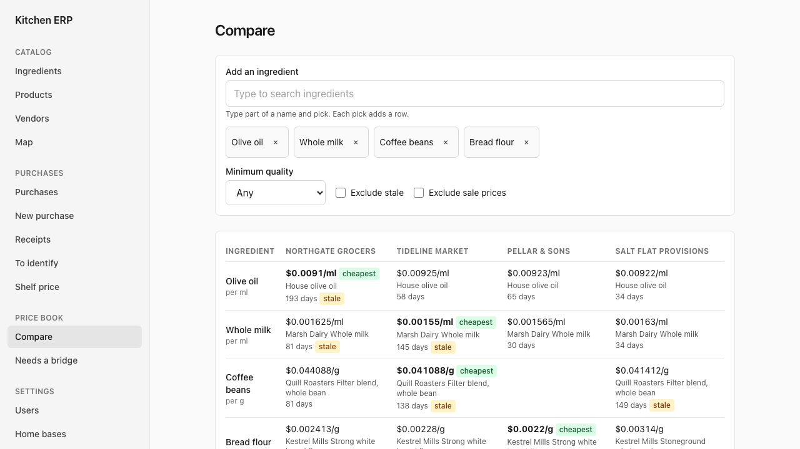
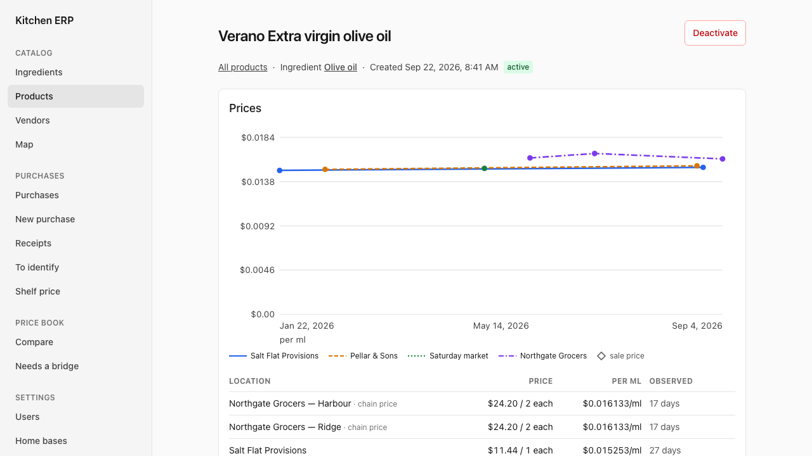
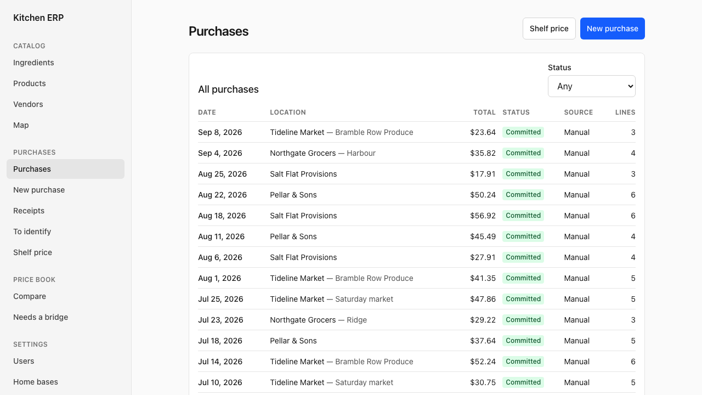

# Kitchen ERP

[](https://github.com/jdmacleod/kitchen-erp/actions/workflows/ci.yml)
[](https://github.com/jdmacleod/kitchen-erp/actions/workflows/safeguards.yml)
[](LICENSE)

**Know what groceries actually cost you, and where.**

A self-hosted household kitchen system: vendors, products, purchases, and price
history first; recipes, costing, shopping trips, and inventory later. One
deployment serves one household. The specification lives in `docs/spec/`.

Every price the household has ever paid, normalized to a comparable unit, per
vendor, over time:



Prices come from receipts, from manual entry, or from a shelf price noticed in
passing. Each one is an immutable observation; the normalized figures above are
derived and can be rebuilt at any time.





Every screenshot above is the synthetic demo household, not anyone's real data.
You can run exactly that yourself — see **Try it first** below.

This repository is public and a running deployment holds personal data. Read
`SECURITY.md` before contributing: nothing from a real receipt, a real home, or
a real person is ever committed, and the hooks in `.pre-commit-config.yaml`
enforce that.

## Try it first

A throwaway stack with an invented household in it — made-up vendors, made-up
products, `example.com` people, and coordinates in the open Pacific. It shares no
volume, no database, and no port with a real deployment.

```bash
make demo-up      # web on http://127.0.0.1:8081
make demo-seed    # 14 ingredients, 4 vendors, ~8 months of purchases
make demo-down    # and its volumes are gone
```

Sign in as `demo@example.com` / `demo-only-not-a-real-password`.

`make screenshots` recaptures the images above from that stack. It refuses to
photograph a database that is not the seeded synthetic one.

## Quickstart

```bash
cp .env.example .env            # then change the two passwords
make up                         # db, api, worker, web
docker compose exec api kerp migrate         # also seeds the unit table
docker compose exec api kerp create-admin   # prompts for email, name, password
```

`create-admin` prompts, so it needs a terminal. Scripting it (or running it over
`exec -T`) takes the values as flags instead:

```bash
docker compose exec -T api kerp create-admin \
  --email you@example.com --display-name "Your Name" --password '<password>'
```

`make up` is `docker compose up -d --build` with the build identity resolved from
git and passed in, so the running deployment can tell you which commit it is. Plain
`docker compose up -d --build` works too and reports `dev` — Compose cannot run git
itself, so nothing can fill those in without make. The sidebar shows whichever it
got.

To check which build is running, look at the bottom of the sidebar, under the
health line. A `dev` badge there means the build is not a clean tagged release:
an untagged commit, a tree with uncommitted changes, or an image built without
the args. The same answer without a browser:

```bash
docker compose exec api kerp --version   # kitchen-erp <version> (<commit>)
```

Open <http://localhost:8080> and log in. The API is also reachable directly at
<http://localhost:8000/api/docs>.

On macOS run Ollama natively on the host; the default `OLLAMA_BASE_URL` reaches
it through `host.docker.internal`. On a Linux host with a GPU, add
`--profile llm` to run it in Docker and set `OLLAMA_BASE_URL=http://ollama:11434`.
The system is fully usable for manual workflows with no model server running.

## Optional reference data

Both are optional and local. The system works fully without them.

- **USDA FoodData Central** portions, used only to suggest densities and named
  measures when an ingredient is created. Download the "Full Download of All Data
  Types" CSV bundle from <https://fdc.nal.usda.gov/download-datasets> (public
  domain), unzip it under `data/usda/`, then:

  ```bash
  docker compose exec api kerp import usda-portions --path /data/usda/<unzipped-dir>
  ```

- **Map tiles**: a PMTiles extract of your region under `data/tiles/`. See
  `docs/tiles.md` for how to cut one and for the attribution it carries.

## Receipts, imports, and backups

- **Receipts** are uploaded from the web UI (or the capture API) and pass through
  the ingest worker; the review screen is where unresolved lines get identified
  once and remembered as aliases.
- **Retailer exports** in the documented JSON format (see `backend/app/services/importer.py`)
  load with `docker compose exec api kerp import purchases --from /data/imports/<file>.json --as <admin email>`.
  Keep real exports under `data/imports/`, which is never committed.
- **Backup and restore**:

  ```bash
  docker compose exec api kerp backup --out /data/backups/$(date +%F)
  docker compose exec api kerp restore --from /data/backups/<dir>        # refuses a non-empty database
  docker compose exec api kerp restore --from /data/backups/<dir> --force
  ```

  A backup holds a `pg_dump` custom-format dump, every receipt image, and a
  manifest with hashes and row counts. Restore verifies the hashes.
- **Capture API contract**: `docs/api/openapi.json` is generated by
  `docker compose exec api kerp export-openapi`; a test fails on drift.

## What a default deployment exposes

Worth knowing before you put this anywhere:

- **The web UI binds to every interface** (`WEB_PORT`, default `8080`), because the
  point of it is capturing receipts from a phone on the same network. Anyone who
  can reach that port gets the login page. Set `WEB_BIND=127.0.0.1` to keep it on
  the machine itself.
- **The database and the API bind to `127.0.0.1` only.** Nothing else needs them.
- **`COOKIE_SECURE=false` by default**, because the default deployment is plain
  HTTP on a home network. Put it behind TLS and set it to `true`; session cookies
  travel in the clear otherwise.
- **This is built for a trusted home network, not the public internet.** There is
  no rate limiting on the login form and no brute-force lockout. If you want it
  reachable from outside, put it behind a VPN or an authenticating proxy.
- **No outbound calls are required.** Overpass and Nominatim are off by default;
  the language model is whatever `OLLAMA_BASE_URL` points at, and the system is
  fully usable for manual workflows with no model server at all.

## Tests

```bash
docker compose exec api pytest          # backend suite, against a throwaway database
docker compose exec api pytest -m llm   # opt-in, needs a live model
```

The suite creates a fresh database on the Compose `db` service for each run and
drops it afterwards, so it never touches the household's data.

## Development without Docker for the API

```bash
docker compose up -d db
cd backend && uv sync
export DATABASE_URL=postgresql+asyncpg://kerp_app:<app-pw>@127.0.0.1:5433/kerp
export MIGRATION_DATABASE_URL=postgresql+asyncpg://kerp_owner:<owner-pw>@127.0.0.1:5433/kerp
uv run kerp migrate
uv run uvicorn app.main:app --reload
uv run pytest
```

## Contributing

Read [`CONTRIBUTING.md`](CONTRIBUTING.md) first, and `SECURITY.md` with it. The
short version: `make setup` installs the git hooks, `make check` runs everything
CI runs, and **no real receipt, address, coordinate, or screenshot of real data
ever goes into an issue, a PR, a fixture, or a commit message.** Reproduce
problems against the demo stack instead.

[`CODE_OF_CONDUCT.md`](CODE_OF_CONDUCT.md) applies. `docs/licensing.md` records
what may be borrowed from the reference projects — two are AGPL-3.0 and their
code must never enter this tree — and which third-party data carries attribution
obligations.

## Licence

MIT. See [`LICENSE`](LICENSE).
