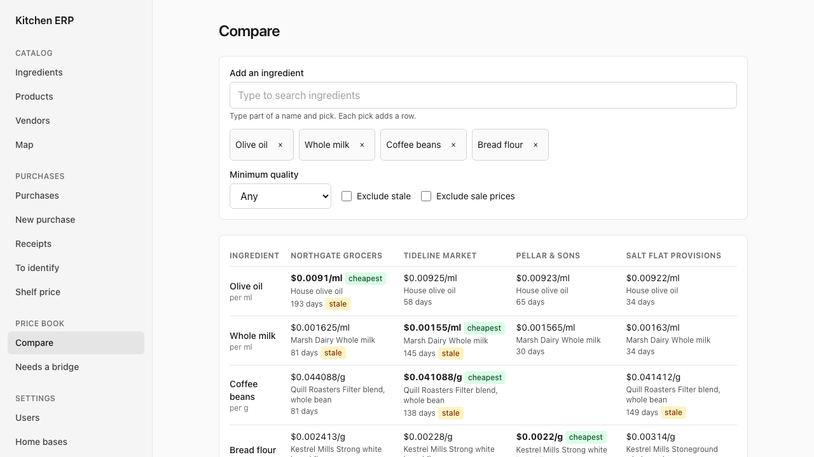
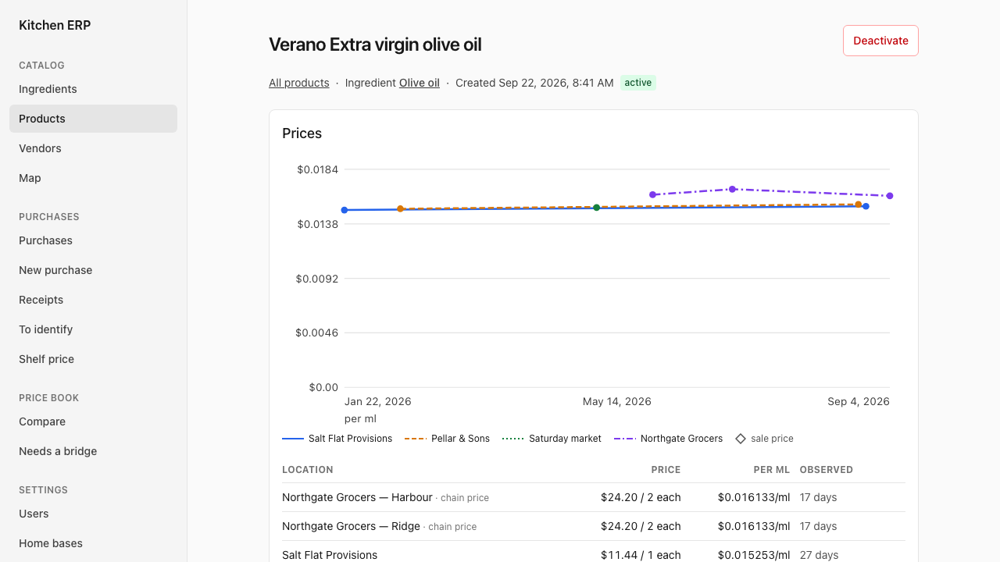
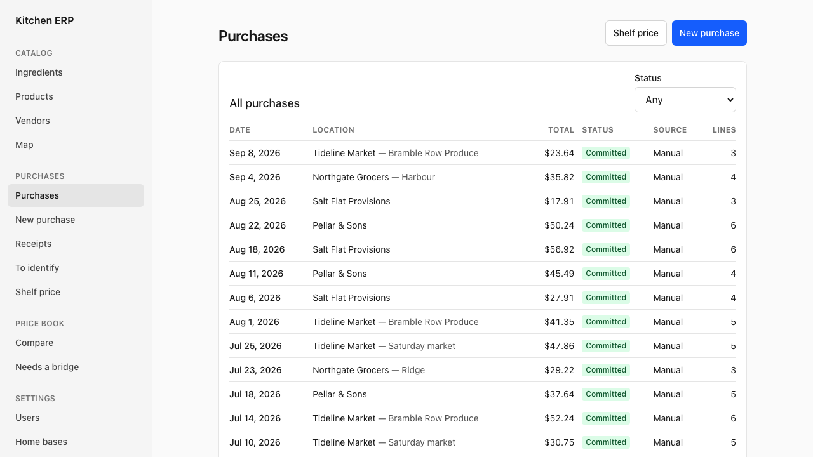

# Kitchen ERP

[](https://github.com/jdmacleod/kitchen-erp/actions/workflows/ci.yml)
[](https://github.com/jdmacleod/kitchen-erp/actions/workflows/safeguards.yml)
[](LICENSE)

**Know what groceries actually cost you, and where.**

A self-hosted household kitchen system: vendors, products, purchases, and price
history first; recipes, costing, shopping trips, and inventory later. One
deployment serves one household. The specification lives in `docs/spec/`.

Every price the household has ever paid, normalized to a comparable unit, per
vendor, over time:



Prices come from receipts, from manual entry, or from a shelf price noticed in
passing. Each one is an immutable observation; the normalized figures above are
derived and can be rebuilt at any time.





Every screenshot above is the synthetic demo household, not anyone's real data.
You can run exactly that yourself — see **Try it first** below.

This repository is public and a running deployment holds personal data. Read
`SECURITY.md` before contributing: nothing from a real receipt, a real home, or
a real person is ever committed, and the hooks in `.pre-commit-config.yaml`
enforce that.

## Try it first

A throwaway stack with an invented household in it — made-up vendors, made-up
products, `example.com` people, and coordinates in the open Pacific. It shares no
volume, no database, and no port with a real deployment.

```bash
make demo-up      # web on http://127.0.0.1:8081
make demo-seed    # 14 ingredients, 4 vendors, ~8 months of purchases
make demo-down    # and its volumes are gone
```

Sign in as `demo@example.com` / `demo-only-not-a-real-password`.

`make screenshots` recaptures the images above from that stack. It refuses to
photograph a database that is not the seeded synthetic one.

## Quickstart

```bash
cp .env.example .env            # then change the two passwords
make up                         # db, api, worker, web
docker compose exec api kerp migrate         # also seeds the unit table
docker compose exec api kerp create-admin   # prompts for email, name, password
```

`migrate` prints each migration as it runs, then how many it committed and the
revision the database is now at, or that there was nothing to do. It is safe to
run after every update.

`create-admin` prompts, so it needs a terminal. Scripting it (or running it over
`exec -T`) takes the values as flags instead:

```bash
docker compose exec -T api kerp create-admin \
  --email you@example.com --display-name "Your Name" --password '<password>'
```

`make down` stops the stack and removes its containers, including a
containerized Ollama. The database volume and the receipt files under `data/` are
kept. `make up` restarts the default stack; if you use containerized Ollama, run
`docker compose --profile llm up -d` to restart it too.

`make up` is `docker compose up -d --build` with the build identity resolved from
git and passed in, so the running deployment can tell you which commit it is. Plain
`docker compose up -d --build` works too and reports `dev` — Compose cannot run git
itself, so nothing can fill those in without make. The sidebar shows whichever it
got.

To check which build is running, look at the bottom of the sidebar, under the
health line. A `dev` badge there means the build is not a clean tagged release:
an untagged commit, a tree with uncommitted changes, or an image built without
the args. The same answer without a browser:

```bash
docker compose exec api kerp --version   # kitchen-erp <version> (<commit>)
```

Open <http://localhost:8080> and log in. A new deployment lands on a two-step
checklist: add somewhere you shop, then record your first purchase. Dropping a pin
on the map creates the shop and its location together, and the purchase form
creates products and their ingredients as you type them, so those two steps are
the whole setup. The checklist is replaced by the home page once a purchase lands.
The API is also reachable directly at <http://localhost:8000/api/docs>.

On macOS run Ollama natively on the host; the default `OLLAMA_BASE_URL` reaches
it through `host.docker.internal`. On a Linux host with a GPU, add
`--profile llm` to run it in Docker and set `OLLAMA_BASE_URL=http://ollama:11434`.
The system is fully usable for manual workflows with no model server running.

Reading a receipt waits on the model. Connecting is bounded apart from the answer
(`LLM_CONNECT_TIMEOUT_SECONDS`, 5 s), so a model server that is not running is
reported within seconds. Each request may then take `LLM_TIMEOUT_SECONDS` (120),
and the lines stage gets `LLM_LINES_SECONDS_PER_LINE` (3) more per line of receipt
text, because it writes every line out: a 25-line receipt took 95 s on a 20B
model on a LAN host. Raise the base for a larger model or a busier host; a job
that runs out says `model_timeout`, which names the setting.

## Optional reference data

Each is optional, and the system works fully without them. Only OpenStreetMap
links reach outside the deployment, and only when switched on.

- **USDA FoodData Central** foods and portions, used only to suggest standard
  names, densities and named measures. Download the "Full Download of All Data
  Types" CSV bundle from <https://fdc.nal.usda.gov/download-datasets> (public
  domain), unzip it under `data/usda/`, then:

  ```bash
  docker compose exec api kerp import usda --path /data/usda/<unzipped-dir>
  ```

  Each import replaces the previous one in a single transaction. Keep the
  directory name USDA gives it: the release date is read from it.
  `kerp import usda-portions` is the command's earlier name.

- **Retailer adapters for captured pages (optional, 2M).** Every captured
  product page is read generically: its structured data, meta tags and address
  when it is saved, then the text model in the background. A retailer-specific
  adapter runs beside the model and can add fields. It receives the page's
  addresses, title, meta tags, structured data and text, but not its images. It is a pure
  Python function `adapter(page: dict) -> list[dict]` returning
  `[{"field": "price", "value": "3.49"}, ...]`. A price by weight is
  `{"amount": "0.69", "qty": "1", "unit": "lb"}`. Adapters are kept outside
  this repository, because they show which stores you use: in `data/plugins/`
  (mounted read-only at `/plugins`), named in `.env`:

  ```bash
  PRODUCT_ADAPTERS=["my_shop:read"]
  ```

  An adapter does no I/O. A missing or failing one is skipped. `/api/v1/health`
  lists each adapter as loaded, missing or invalid, and reports "degraded" if
  any did not load.

  The private `kitchen-erp-products` helper ships adapters for the stores it
  knows, behind one entry point. To use them here, run
  `kerp-products install-plugins --to <this folder>/data/plugins` from the helper,
  set `PRODUCT_ADAPTERS=["kerp_products.adapters:adapt"]`, and restart with
  `make up`. They matter most for stores that only a browser can read, whose pages
  reach Kitchen ERP only through the clip window.

- **USDA branded foods by barcode (optional, 2L).** A scanned barcode the
  catalog does not know is looked up in a local table of USDA branded foods
  before it becomes a proposal. Download the "Branded" CSV bundle from the same
  page, unzip it under `data/usda/`, then:

  ```bash
  docker compose exec api kerp import usda --branded --path /data/usda/<unzipped-branded-dir>
  ```

  It keeps the latest row for each barcode and lists the codes that are not
  valid barcodes. Like the import above, it is a local read: nothing is sent
  anywhere.

- **The standard ingredient list and USDA suggestions (1G).** Upgrading to a
  release with the ingredient vocabulary is a few steps, in this order:

  1. `docker compose exec api kerp backup --out /data/backups/before-1g`. Merges
     can't be undone in the app, so keep a way back, and take a backup before
     any downgrade too.
  2. `docker compose exec api kerp migrate`. Every existing ingredient starts
     as "to review" against the standard list.
  3. `docker compose exec api kerp import usda --path /data/usda/<unzipped-dir>`
     (above). It is optional, but without it nothing links to a USDA food.
  4. Home shows "n ingredients to link to the standard list". On that page,
     link, rename or skip each one; where two ingredients are one, merge them.
  5. Then Home shows "n ingredients have USDA densities to review", which
     opens the USDA suggestions on Needs a bridge. Accepted values are saved
     as unconfirmed: confirm each on its ingredient page after checking a
     label or weighing it.

- **Receipt photos without their metadata (#221).** New uploads are stored
  without GPS, EXIF or XMP. Photos stored before keep theirs until this runs
  once, after `kerp migrate`, while no receipt is being read:

  ```bash
  docker compose exec api kerp receipts strip-metadata --dry-run   # counts only
  docker compose exec api kerp receipts strip-metadata
  ```

  Take a backup first: the old files are replaced. It refuses to start while a
  stored file is missing, and it leaves a receipt that is being read; run it
  again later for those.

  `kerp ingredients check` lists plurals another ingredient already has,
  ingredients with no USDA reference, and references missing from the loaded
  release. `kerp ingredients usda-candidates <fdc id | text>` lists raw or dry
  USDA records to choose a reference from.

- **OpenStreetMap links**, off unless `ENABLE_OVERPASS=true`. With it on, a
  location's card offers "Link to OpenStreetMap", which lists the places within
  250 m of its pin and fills in the address, hours, phone and website it is
  missing; anything you typed stays. To re-read every linked location later:

  ```bash
  docker compose exec api kerp osm refresh --all-linked
  ```

- **Vendor files.** The vendor list exports as a `kitchen-erp-vendors/1` file,
  YAML or JSON, from Export on the Vendors page or the command line:

  ```bash
  docker compose exec api kerp export vendors --mode public --format yaml --out /data/exports/vendors.yaml
  ```

  `public` holds only locations you ticked "Share in public export" on or linked
  to OpenStreetMap, and none of your notes, kitchens, store codes or stands:
  read it before contributing it anywhere. `household` holds everything and is
  for moving between your own deployments; keep it private. See spec 03 §1F.

  Import reads the same files, from Import on the Vendors page or:

  ```bash
  docker compose exec api kerp import vendors --from /data/exports/vendors.yaml --dry-run
  ```

  A dry run (the page always starts with one) says what would be created,
  updated or left alone, and what needs you. Import never overwrites a field
  you edited, never deletes anything, and never creates a kitchen.

- **Ingredient files.** The ingredient vocabulary exports as a
  `kitchen-erp-ingredients/1` file: names, categories, units, densities,
  spellings, USDA references and measures, with nothing from purchases, prices
  or vendors. Use it to move the vocabulary to another deployment or to share a
  list:

  ```bash
  docker compose exec api kerp export ingredients --out /data/exports/ingredients.json
  docker compose exec api kerp import ingredients --from /data/exports/ingredients.json --dry-run
  ```

  Import matches by key, name or spelling. It adds what is missing, never
  overwrites a field you edited, and never deletes, renames or merges an
  ingredient. Run it without `--dry-run` once the report looks right. See
  spec 03 §1G.

- **Suggestions from an enrichment tool.** A tool that fills in missing store
  facts works through the API with a token made under Settings → API tokens as
  "Read and suggest vendor facts". That token can read the public vendor file
  and post suggestions (`POST /api/v1/vendor-suggestions`), and nothing else:
  every other route answers 403. Suggestions wait in the inbox; nothing changes
  until you accept one. Whatever such a tool sends to a hosted model has left
  your deployment, so choose the model accordingly.

- **Map tiles**: a PMTiles extract of your region under `data/tiles/`. See
  `docs/tiles.md` for how to cut one and for the attribution it carries.

## Receipts, imports, and backups

- **Receipts** are uploaded from the web UI (or the capture API) and pass through
  the ingest worker; the review screen is where unresolved lines get identified
  once and remembered as aliases. See "Reading a receipt, start to finish" below.
- **Retailer exports** in the documented JSON format (see `backend/app/services/importer.py`)
  load with `docker compose exec api kerp import purchases --from /data/imports/<file>.json --as <admin email>`.
  Keep real exports under `data/imports/`, which is never committed.
- **Backup and restore**:

  ```bash
  docker compose exec api kerp backup --out /data/backups/$(date +%F-%H%M)
  docker compose exec api kerp restore --from /data/backups/<dir>        # refuses a non-empty database
  docker compose exec api kerp restore --from /data/backups/<dir> --force
  ```

  A backup holds a `pg_dump` custom-format dump, every receipt image, and a
  manifest with hashes and row counts. Restore verifies the hashes. Backup
  refuses a directory that already holds a backup, so a second run can't
  destroy the first; pass `--force` to replace it (for a script that always
  writes to the same "latest" directory).
- **Capture API contract**: `docs/api/openapi.json` is generated by
  `docker compose exec api kerp export-openapi`; a test fails on drift. Scripts
  and capture apps authenticate with a token made under Settings → API tokens,
  sent as a bearer header. Uploading a receipt from the command line:

  ```bash
  curl -H "Authorization: Bearer $KERP_TOKEN" \
    -F image=@receipt.jpg -F captured_at=2026-03-04T17:42:00Z \
    http://localhost:8000/api/v1/receipts
  ```

  The same file uploaded twice is recognised by its hash and not read again,
  unless it was removed: uploading a removed receipt reads it again.

### Reading a receipt, start to finish

1. **Upload** it under Shop → Receipts. It is read in the background: text
   first (OCR), then the header (store, date, totals) and the lines through the
   model, so allow a minute or more per receipt on a LAN model server. Receipts
   being read show as Reading rows on Purchases.
2. **Finish it from Home.** Each read receipt becomes an inbox item. On its page,
   check the header first: pick the store from the location candidates or the
   Location list (a branch is picked for you when its store code, its own phone
   number or its address is printed; link your stores to OpenStreetMap or import
   their details so there is something to match), correct the date and total from the receipt image, and press
   Save header. A warning above the header says when the date or total was not
   read and is standing in.
3. **Check the lines.** "Needs you" lists the lines to look at. Edit a line's
   quantity, unit or price where the reader got it wrong, and delete a line that
   is not a purchase. A weight printed on its own line above the item (such as
   `2.71 lb @ 3.99 /lb`) may be read as a separate line: put the weight on the
   item line and delete the other. "Lines add up to" should then match the total.
4. **Identify what you can**, choosing an existing product or creating one
   inline, then **Commit**. Resolved lines enter the price book at once; the rest
   wait in the to-identify queue (Home's "lines to identify" item), grouped by
   store and wording, where one choice applies to every matching line and is
   remembered for next time.
5. **Mistakes** are corrected by reopening the purchase, or by removing it at the
   foot of its page: a receipt that never reached the price book is deleted with
   its photo; one that did is voided and kept.

## Adding a product from a web page, start to finish

A store's product page, or a brand's own page, can become a product in your
catalog. Kitchen ERP never fetches the page itself: your browser sends what it
shows, and nothing enters your catalog until you accept it.

1. **Once: install the bookmarklet.** Open Settings → Capture and drag
   **Save to Kitchen ERP** to the bookmarks bar. On an iPhone, use Copy the code,
   bookmark any page, then paste the code as that bookmark's address. The
   bookmarklet is tied to the address you installed it from. Reinstall it if
   that address changes.
2. **Once per store: give the vendor its website.** A page is matched to a
   vendor by its host, so set the website on the store's vendor (Vendors → the
   store → Edit vendor). A brand's own site needs no vendor.
3. **Clip the page.** On the product's page, click the bookmark. Allow pop-ups
   for that site if the browser asks, and sign in inside the small window if it
   asks.
   - The window shows the page title and "N images came along, M saved with
     it". Up to four images your browser could read are kept as photos.
   - Then it says either "From {store}" or "Not one of your vendors". In the
     second case, Save stays disabled until you pick the vendor or tick
     **Save without a store (no listing or price)**. Use that for a brand's site.
   - Press **Save**. "Saved · Review it in Needs you" opens the review in a new
     tab. Clipping the same page again while it waits gives "Already saved ·
     Open it". A changed copy of the page replaces the waiting one.
4. **Let it be read.** The page's structured data and tags are read at once.
   Its text is read by the model in the background. The review then shows one
   reading line: "Read from the page.", or why nothing was read (for example,
   "The model couldn't be reached").
5. **Review it.** Home shows "n products to review". On the review page:
   - **Match:** update an existing product, or **Create new product**. For a
     new one, choose its ingredient and kind. A strong match starts collapsed;
     **Edit details** opens the fields.
   - **Fields** (name, brand, pack, barcode): each value carries a badge for
     where it came from (Store page, Manufacturer, Model's guess…). Where
     sources offer different values, pick one; a conflict must be settled
     before Accept. A field with a single value can be typed over.
   - **Photos:** choose the main one, set roles, hide any you don't want.
   - **Price** (store pages only): "Posted at $3.49", or "$0.69 / lb" when the
     page prices by weight. **Record this posted price** comes pre-ticked, with
     the store you last bought from at that vendor; otherwise tick it and choose
     the store. A vendor with no stores gets "Not one of your stores, so no price
     is recorded." **Change the price or what it is for** corrects the amount,
     quantity or unit. A page that prices the same item both per pound and each
     asks you to say which.
   - **Accept** (or Ctrl/⌘+Enter) creates the product, or fills in the gaps on
     the existing one (values it already has are kept). It also saves the
     page's listing, its item number, and the posted price if ticked. Receipt
     lines waiting in the to-identify queue that print the product's new code
     are matched to it then, and their prices recorded. A barcode
     that belongs to another product offers "Update {that product} instead".
     **Reject** drops the proposal; the capture record is kept.
6. **Afterwards.** A posted price shows in the product's price records as
   "Posted online, not counted in cheapest": only receipts and shelf prices
   count there. Whether you accept or reject, the page text is deleted; the
   page's address and tags are kept.

**If the window says "This site blocks clipping"**, the page and the pop-up
could not talk to each other: the store blocks it, or the page did not answer
within 10 seconds. Use Products → Add product and paste the address into Web
address. Only the name is filled in, and only if the name field is empty. The
item number shows as a hint. Without the lookup helper (below), the page is not
read and the address is not saved, so no listing or price is created: enter the
rest by hand. With the helper connected, saving sends the page to it. What it
finds (details, photos, and for one of your stores the listing and posted
price) comes back as "1 product update to review" on Home.

**The optional lookup helper.** `kitchen-erp-products` is a separate program
that does the outbound work this app never does: it looks up barcodes and reads
pages, and reports posted-price changes. To connect one:

1. Make a token under Settings → API tokens, choosing **Products lookup helper**.
2. Give that token to the helper.

The helper runs as its own container beside this stack, outside its Compose project,
reaching the API at `http://host.docker.internal:8000` with that token. Its repository
says how to build and start it, and how to update it. Check it with
`docker logs kerp-products`: one line per request.

Once it is connected, the review page offers **Look this up online**, and an
address pasted in Add product is sent to it on save. The helper's answer joins
the proposal, or opens a product update for a product you already have; either
way, you still accept it. The helper also
revisits each product page every `LISTING_REFRESH_DAYS` (7 by default; 0 turns
it off), while a helper token exists. Changed
prices appear on Home as "n posted prices changed". Its Review opens the posted
prices page, where each one waits until you accept or reject it.

## What a default deployment exposes

Worth knowing before you put this anywhere:

- **The web UI binds to every interface** (`WEB_PORT`, default `8080`), because the
  point of it is capturing receipts from a phone on the same network. Anyone who
  can reach that port gets the login page. Set `WEB_BIND=127.0.0.1` to keep it on
  the machine itself.
- **The database and the API bind to `127.0.0.1` only.** Nothing else needs them.
- **`COOKIE_SECURE=false` by default**, because the default deployment is plain
  HTTP on a home network. Put it behind TLS and set it to `true`; session cookies
  travel in the clear otherwise.
- **This is built for a trusted home network, not the public internet.** There is
  no rate limiting on the login form and no brute-force lockout. If you want it
  reachable from outside, put it behind a VPN or an authenticating proxy.
- **No outbound calls are required.** Overpass and Nominatim are off by default;
  the language model is whatever `OLLAMA_BASE_URL` points at, and the system is
  fully usable for manual workflows with no model server at all.

## Tests

```bash
docker compose exec api pytest          # backend suite, against a throwaway database
docker compose exec api pytest -m llm   # opt-in, needs a live model
```

The suite creates a fresh database on the Compose `db` service for each run and
drops it afterwards, so it never touches the household's data.

```bash
make e2e    # browser tests (Playwright) on a throwaway stack, web on :8082
```

The browser tests create vendors, products and prices that the app can only
deactivate, never delete, so they never run against the household's stack.
`make e2e` starts a separate Compose project (`compose.e2e.yaml`, its own
volumes), runs the suite, and deletes the project and its volumes, pass or
fail. `make e2e-up` / `make e2e-down` do the halves by hand, for debugging a
spec with `cd e2e && corepack pnpm exec playwright test <spec>`.

## Development without Docker for the API

```bash
docker compose up -d db
cd backend && uv sync
export DATABASE_URL=postgresql+asyncpg://kerp_app:<app-pw>@127.0.0.1:5433/kerp
export MIGRATION_DATABASE_URL=postgresql+asyncpg://kerp_owner:<owner-pw>@127.0.0.1:5433/kerp
uv run kerp migrate
uv run uvicorn app.main:app --reload
uv run pytest
```

## Contributing

Read [`CONTRIBUTING.md`](CONTRIBUTING.md) first, and `SECURITY.md` with it. The
short version: `make setup` installs the git hooks, `make check` runs everything
CI runs, and **no real receipt, address, coordinate, or screenshot of real data
ever goes into an issue, a PR, a fixture, or a commit message.** Reproduce
problems against the demo stack instead.

[`CODE_OF_CONDUCT.md`](CODE_OF_CONDUCT.md) applies. `docs/licensing.md` records
what may be borrowed from the reference projects — two are AGPL-3.0 and their
code must never enter this tree — and which third-party data carries attribution
obligations.

## Licence

MIT. See [`LICENSE`](LICENSE).
